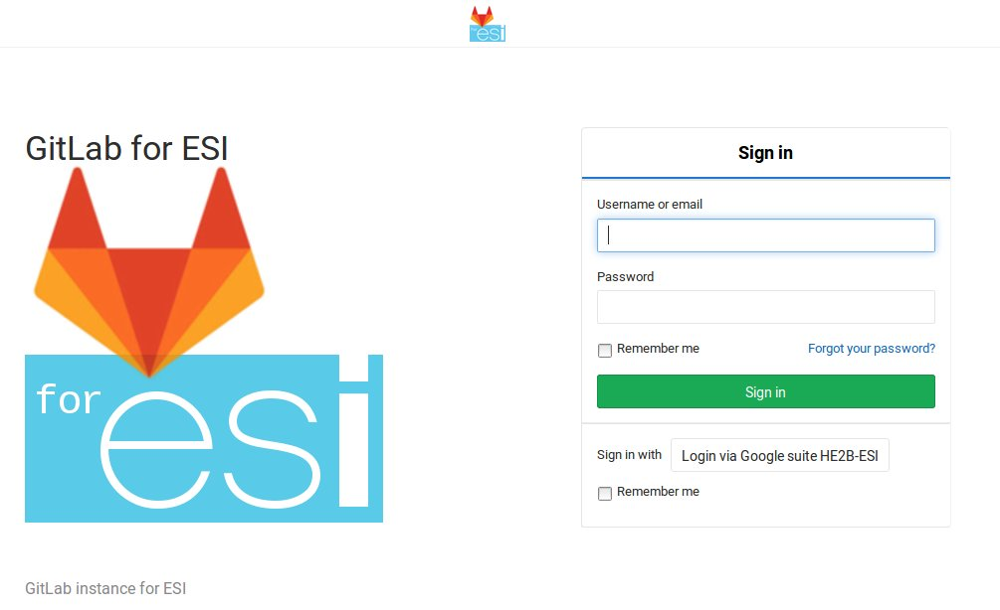
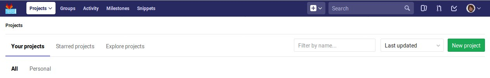
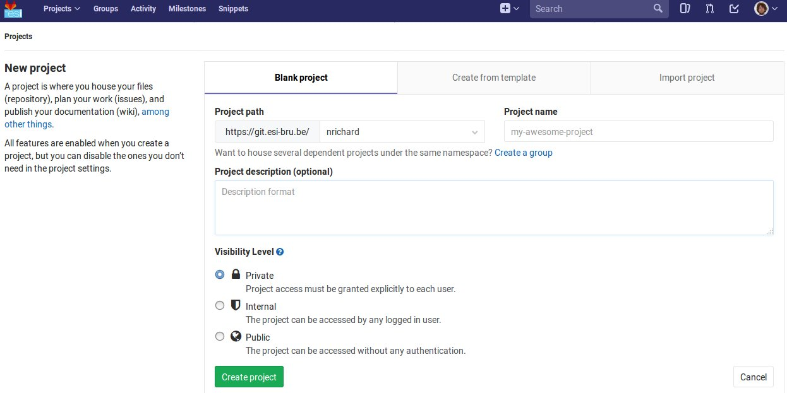

% git - the stupid content tracker
% Nicolas Richard <nrichard@he2b.be>
% Année 2018-2019

# Contexte
## But
Le but du TD est d'apprendre le maniement basique de Git.

Git est un logiciel de gestion de versions ("revision control" ou "version
control"). Ce type de logiciels, et git en particulier, est utilisé par de
nombreux développeurs, tant en solitaire qu'en équipes, notamment pour :

* revenir et comparer différentes versions de leur code ou tout document 
stocké comme un texte,
* comprendre l'apparition de bugs éventuels
* travailler en équipe

Au travers de ce TD nous vous montrerons comment Git aide à réaliser ces
objectifs.

## Pré-requis
Utilisation basique :

* de la ligne de commande sur Git Bash et linux1
  * éditer des fichiers
  * lancer des commandes
  * copier-coller depuis Windows vers linux1,
* de Netbeans
  * créer un projet Java
* du langage Java
  * écriture sur la sortie standard

## Savoirs terminaux
Voici les commandes que vous connaitrez à la fin de ce TD.
Revenez-y en fin de TD pour vérifier que vous comprenez chacune d'elle.

    git init
    git status
    git add <file>...
    git commit -m <message>
    git branch [-a]
    git log [--stat]
    git show <commit>
    git diff [--cached]
    git diff <commit1> <commit2>
    git merge <branch>
    gitk
    git remote add <name> <url>
    git remote [-a] -v
    git remote update

Nous décrirons également le fichier `.gitignore`.


# Contenu
## Introduction
### Notion de contrôle de version
Si vous avez déjà écrit un document un peu long, vous vous êtes sans doute déjà
trouvé dans la situation où, après une grosse modification, vous changez d'avis
et décidez que la version précédente était meilleure.

La façon la plus courante de s'en sortir est simplement de faire des copies de
votre travail avant (ou après) chaque modification importante. Si vous écrivez
un fichier `monTravail.txt` et que tout va bien, les versions se succèdent
simplement et ça doit donner ceci :

    monTravail-version-du-3-juin.txt
    monTravail-version-du-12-juin.txt
    monTravail-version-du-13-juin.txt
    monTravail.txt <= Ceci est la version finale.


Cela fonctionne assez bien mais nous verrons que même dans ce cas simple, Git
pourra nous aider.

Cependant, en pratique, il est plus probable que vous obteniez des fichiers un
peu comme ceci (dans l'ordre chronologique) :

    monTravail-version-du-3-juin.txt
    monTravail-version-du-12-juin.txt
    monTravail-version-finale.txt
    monTravail-version-finale-avec-remerciements.txt
    monTravail-version-finale-corrigée.txt
    monTravail-version-finale-corrigée-avec-remerciements.txt
    monTravail-version-vraiment-finale.txt
    monTravail.txt <= Hm, à quoi ça correspond déjà ?

Ceci illustre un point : le processus de création n'est pas toujours linéaire,
même quand on travaille tout seul. Essayez de représenter les liens logiques
entre les différentes versions.

Voici une telle représentation :


En première approche, le travail avec Git ressemblera au travail sans Git :

1. création d'un document
2. sauvegarde dans Git
3. modification du document
4. retour à l'étape 2 (sauf si le document est fini)
5. fini !

À ce stade les aspects importants de Git sont notamment qu'il :
* va gérer pour vous les liens logiques entre les versions,
* vous propose des outils pour comparer et fusionner des versions.

### Environnement de travail
Dans l'école, Git est déjà installé, tant sur les machines Windows que sur le
serveur `linux1`.

Par ailleurs la conception de `Git` est telle que nous allons travailler *dans
un répertoire dédié* à notre projet. Cela peut vous sembler étrange si vous
pensez à l'exemple `monTravail.txt` (dans lequel il n'y a finalement qu'un
document en plusieurs versions) mais d'un autre côté, un projet de programmation
va généralement rassembler de nombreux fichiers qu'il est naturel de mettre dans
un répertoire dédié.

Commençons par créer et aller dans le répertoire `~/dev1/td-git/ex1/` (utilisez `mkdir -p`).

## Création d'un dépôt Git et de commits
### Initialisation : git init
ACTION: Initialisons un "dépôt Git" dans notre répertoire de travail :

    git init

Voyez-vous ce qui a changé dans le répertoire courant ?

Si vous ne voyez pas, pensez aux fichiers cachés.

R: un répertoire `.git` est apparu (voir `ls -a`).

Le répertoire `.git` est le dépôt Git proprement dit. C'est lui qui contiendra
les différentes sauvegardes (nous diront "commit"). Le répertoire courant, quant
à lui, est appelé "répertoire de travail".


Astuce : pour voir tous les fichiers (y compris dans les sous-répertoires) du
répertoire courant, utilisez: `find . -type f`. Essayez aussi `find .` tout seul
pour voir la différence.

### Intermède : créer un projet
Utiliser Git sans projet à construire, c'est un peu comme braquer une caméra de
surveillance sur un mur.

Nous allons donc développer un projet. Il ne sera pas très ambitieux car le but
est d'apprendre Git en moins de 2 heures, mais c'est mieux que rien.

ASTUCE: Si vous avez un projet Java en tête, sentez-vous libre de remplacer le
projet HelloWorld ci-dessous par votre propre projet. Pensez seulement à adapter
les instructions.

ACTION: Lancez NetBeans et créez un projet de type Java Application dans le
répertoire suivant: `Z:\dev1\td-git\` que vous nommez `HelloWorld`. Cliquez
"Finish" mais ne faites rien de plus (ne compilez pas tout de suite).

Les prochaines étapes consisteront en l'élaboration de notre projet. À chaque
étape, nous allons sauver l'état du répertoire, comme une sauvegarde du travail.

### Sélection des fichiers : git add
ACTION: Revenez à Git Bash, et allez dans le répertoire de votre projet
`HelloWorld`. Inspectez le contenu de votre répertoire, puis créez un dépôt Git
dans ce répertoire.

Netbeans crée de nombreux fichiers dans le répertoire du projet, y compris dans
des sous-répertoires. Nous n'allons pas détailler maintenant le contenu de ces
fichiers, mais simplement accepter qu'ils sont là.

Astuce : si vous êtes curieux, vous pouvez regarder précisément quels fichiers
ont été créés par NetBeans (rappel: `find . -type f`).

ACTION: Pour voir ce que Git comprend de votre répertoire, entrez :

    git status

Cette commande ne modifie rien, mais montre l'état des choses. Nous apprendrons
à comprendre ce qu'elle dit, mais pour l'heure concentrons nous sur:

    Untracked files:
      (use "git add <file>..." to include in what will be committed)

        build.xml
        manifest.mf
        nbproject/
        src/

    nothing added to commit but untracked files present (use "git add" to track)

Git nous explique qu'il y a un dépôt à cet endroit, mais qu'aucun fichier n'est
suivi ("tracked"), donc rien n'est enregistré. Git s'attend à ce qu'on lui dise
précisément les fichiers à enregistrer.

ACTION: Commençons par indiquer que nous voulons sauvegarder tous les fichiers
du répertoire `src` :

    git add src
    git status

Vous constatez une différence. Notez que Git a été chercher le fichier `.java`
dans un sous-répertoire.

ACTION: Indiquons maintenant que nous voulons en fait sauvegarder tous les
fichiers du répertoire courant :

    git add .

Pensez à lancer `git status` pour voir ce que Git a compris.

Nous sommes prêt à lancer notre premier sauvegarde. Git appelle cela un
/commit/. Nous parlerons donc de "faire un commit" ou de "committer" ("to make a
commit", ou "to commit").

ASTUCE: Allez voir ce que "to commit" veut dire dans un dictionnaire anglais, et
voyez quel sens s'approche le plus de ce que nous faisons.

### Sauvegarde d'une version : git commit
Il est (presque) obligatoire, avec Git, de donner une description à nos commits.

Notre projet en est au stade où Netbeans a généré des fichiers, sans que rien
d'autre n'ait été fait. Nous pouvons donc décrire l'état du projet par :

    HelloWorld: projet créé avec Netbeans

ACTION: Nous l'indiquons à Git :

    git commit -m "HelloWorld: projet créé avec Netbeans"

N.B.: N'oubliez pas les guillemets.

ACTION: Lisez bien ce que Git vous répond et faites ce qui vous est suggéré
(indiquez *votre* adresse email et *votre* nom).

    git config --global user.email "xxx@student.he2b.be"
    git config --global user.name "Votre Nom"

et:

    git commit --amend --reset-author --no-edit

Vérifiez que Git a bien sauvé votre projet avec `git status`. La réponse devrait être:

    On branch master
    nothing to commit, working directory clean


### Laisser des fichiers de côté : `.gitignore`
Lorsque vous lancez une compilation avec NetBeans, ce dernier crée les fichiers
`.class` (et d'autres fichiers) dans le répertoire `build/` de votre projet.

Ce répertoire ne contiendra jamais rien d'autre que ces produits de compilation.
En conséquence de quoi, il n'est pas pertinent de les préserver dans nos
commits. Nous allons donc le faire savoir à Git.


ACTION: Avant chacune des étapes suivantes, utilisez `ls` et `git status` pour
voir l'état de votre répertoire et de votre dépôt.

1. Lancez: `touch qsdf`
2. Indiquez à git d'ignorer `qsdf` avec: `echo qsdf > .gitignore`
3. Nettoyez tout cela avec `rm qsdf .gitignore`.

Qu'avez vous constaté ?

R : 

1. `qsdf` est apparu.
2. `qsdf` a été ignoré par Git (mais toujours présent), mais `.gitignore` est apparu.
3. `qsdf` et ` .gitignore` ont disparu.

Astuce : cherchez ce que fait `touch` sur l'Internet.
Astuce : le sens du symbole `>` vous sera expliqué dans un TD ultérieur (c'est une redirection)

Nous utiliserons ce fichier `.gitignore` pour éviter que certains types de
fichiers apparaissent dans `git status`.

Par exemple les fichiers `.class` seront ignorés de la sorte : ils sont
re-générés à chaque compilation, ils ne sont donc pas nécessaires pour notre
projet. En fait nous allons ignorer tout ce qui se trouvera dans le répertoire
`build`. 

ACTION:

1. Ignorez le répertoire `build` (de la même manière que nous avions ignoré `qsdf`).
2. Incluez `.gitignore` dans un commit dont le message est ".gitignore: new file"

R:

    echo build > .gitignore
    git add .gitignore
    git commit -m "Ignore le répertoire 'build'"


### Intermède : avancer dans le projet
Il est temps d'avancer dans votre projet en suivant les étapes suivantes :

1. Modifier quelque chose (sous Netbeans ou autre éditeur)
2. Ajouter les fichiers modifiés avec `git add` (utilisez `git status` pour voir ce qui est modifié).
3. Committer.
4. Retour à l'étape 1 pour continuer à avancer.

Pour `HelloWorld` nous vous proposons les quelques étapes simples suivantes.

Notez qu'il est possible que `.gitignore` soit encore modifié automatiquement
par Netbeans. Vous pouvez committer ces changements.

#### Faites afficher "Hello, World !" à votre programme java.

ACTION:

1. Modifiez votre code sous Netbeans (et testez avec F6) pour que votre
   application affiche "Hello, World !" sur la sortie standard.
2. Retournez dans Git Bash, et utilisez `git status` pour constater que votre
   fichier .java a été modifié
3. Créez un commit incluant ce fichier `.java`.

Astuce: Dans Netbeans, tapez `sout` suivi d'un appui sur la touche TAB pour insérer
automatiquement de quoi écrire sur la sortie standard.

#### Modularisez "Hello, World!" FIXME: ils ne savent pas encore ce qu'est une méthode
ACTION:
Votre méthode principale `main()` contient actuellement un code tel que

    System.out.println("Hello, World !");

Modifiez cela pour obtenir :

    System.out.println(getHelloMessage());

et écrivez la méthode `getHelloMessage()` pour que le résultat final soit le
même. Une telle transformation s'appelle une "refactorisation".

Dans Git Bash, utilisez encore `sh test.sh` pour vérifier que tout se passe
comme prévu.

Astuce : Dans Netbeans, sélectionnez le texte "Hello, World !" (y compris les
guillemets), et utilisez le raccourci Alt+Enter pour sélectionner l'option
"Introduce Method". Donnez à cette méthode le nom `getHelloMessage`. /Job done./

#### La suite du projet
Nous développerons notre projet plus tard. Passons à autre chose.

## Affichage (et lecture) de l'historique (variante linéaire)
### Affichage l'historique
ACTION: Tapez

    git log

pour voir l'évolution de votre dépôt de son origine jusqu'à maintenant. Vous
devriez y retrouver tous vos commits avec leur description. Le plus récent en haut.

Ici, vous avez une vue d'ensemble de l'histoire de votre dépôt. Chaque commit succède à son prédécesseur (à l'exception du premier, tout en bas). Chaque commit *introduit un certain nombre de différences par rapport au commit d'avant* (une ligne en moins par-ci, une ligne en plus par-là).

Nous verrons, petit à petit, comment :
* montrer les différences introduites par chacun des commits, et
* revenir en arrière dans cet historique

### Lecture d'un commit

Dans le log, notez que chaque commit commence par une ligne du type:

    commit f6fa542074ff1b69c197e5d0a83b5aba5b7038ec

Ce qui se trouve à côté du mot "commit" est un nombre de 40 chiffres
hexadécimaux. Nous l'appelons le "hash" (en français nous dirons parfois
"haché") du commit. Il est produit par une fonction "de hachage" appelée SHA-1.
Vous reverrez encore SHA-1 et d'autres fonctions de hachage en d'autres
occasions.

Le hash d'un commit, c'est son nom. En d'autres termes, pour faire référence au
commit il faut recopier ces 40 caractères. Voyons sur un exemple.

ACTION: Tapez (! remplacez le hash ci-dessous par le hash présent tout en haut
dans votre historique !):

    git show f6fa542074ff1b69c197e5d0a83b5aba5b7038ec
    
Si vous avez réussi sans vous tromper (le copier-coller est votre ami), vous
devriez avoir une vue des modifications introduites par ce commit (par rapport à
son prédécesseur), par exemple:

    commit f6fa542074ff1b69c197e5d0a83b5aba5b7038ec
    Author: Nicolas Richard <youngfrog@members.fsf.org>
    Date:   Mon May 28 17:04:21 2018 +0200

        re-factor the Hello, World ! string

    diff --git a/src/helloworld/HelloWorld.java b/src/helloworld/HelloWorld.java
    index 206c27d..bef5d7c 100644
    --- a/src/helloworld/HelloWorld.java
    +++ b/src/helloworld/HelloWorld.java
    @@ -15,7 +15,10 @@ public class HelloWorld {
          * @param args the command line arguments
          */
         public static void main(String[] args) {
    -        System.out.println("Hello, World !");
    +        System.out.println(getHelloMessage());
         }
    -    
    +
    +    private static String getHelloMessage() {
    +        return "Hello, World !";
    +    }   
     }

Les lignes entre `diff --git ...` et `@@ ...` peuvent rester mystérieuses, mais
le reste devrait vous sembler familier. Prenez deux minutes pour comprendre.

R:
Les premières lignes indiquent le nom du commit, le nom de l'auteur du commit,
la date à laquelle le commit a été fait.

Les lignes suivantes forment la description (que vous avez fournie) du commit.

Suivent quelques lignes mystérieuses (jusque `@@ ... @@ ...`) et enfin le "diff"
du commit, c'est-à-dire une liste des différences entre ce commit et son
prédécesseur. Chaque ligne commence par un symbole `+`, `-`, ou ` `, qui veulent
dire que la ligne a été, respectivmeent, "ajoutée", "enlevée" ou "non-modifiée".

### Un raccourci pour les commits : le short hash.
Pour nommer un commit, vous pouvez généralement vous contenter des 6 ou 7 premiers caractères de son nom. Dans l'exemple, nous aurions pu utiliser:

    git show f6fa542

et obtenir le même résultat.

### Un outil graphique : `gitk`
ACTION: Testez rapidement la commande `gitk` "juste pour voir", puis fermez la fenêtre de ce logiciel et
revenez nous lire.

## Partage et collaboration : ajout de /remotes/
Nous l'avons dit : Git permet de travailler en équipe.

Dans un premier temps nous allons vous faire travailler en équipe... avec
vous-même.

Supposons que vous avez développé un code à l'école et que vous voulez le
continuer chez vous. Comment feriez-vous pour récupérer votre code d'une machine
à une autre ?

R: on peut utiliser une clef USB, un "cloud" (NextCloud, Google Drive, etc.),...
ou Git, bien sûr.

Le principe est le suivant:

* Vous travaillez actuellement sur une machine (Machine1)
* Vous envoyez par le réseau votre travail sur une machine distante (un "serveur") allumée en permanence (Machine1 => Gitlab)
* Vous utilisez une autre machine, par exemple votre ordinateur portable ou une autre machine dans l'école (Machine2)
* Vous récupérez par le réseau votre travail sur la nouvelle machine à partir du serveur.(Gitlab => Machine2).


C'est ce que nous allons faire.

### Gitlab
Les étapes à suivre sont :

1. Créer un dépôt sur votre machine actuelle avec du contenu (ça, c'est déjà fait).
1. Créer un dépôt sur Gitlab.
1. Envoyez le contenu du premier dans le second.
1. Changer de machine.
1. Créer un dépôt sur la nouvelle machine.
1. Récupérer le contenu du dépôt Gitlab dans ce dernier dépôt.

De toutes ces étapes, rassurez-vous, la plus difficile était la première !

#### Connexion à Gitlab
ACTION:
Avec votre navigateur (Firefox, Chrome, ...), connectez vous
à [Gitlab](https://git.esi-bru.be/) en utilisant votre compte HE2B-ESI (Google).



Vous le constatez, Gitlab se présente sous la forme d'un serveur Web. Nous
n'avons pas accès à la ligne de commande sur ce serveur, mais, rassurez-vous,
cela n'est pas tellement plus difficile !

ACTION:
Allez dans [vos paramètres Gitlab]((https://git.esi-bru.be/profile)) (cliquez sur l'icône en haut à droite puis Settings) et choisissez la rubrique [Password](https://git.esi-bru.be/profile/password/edit) puis [I forgot my password](https://git.esi-bru.be/profile/password/reset). Suivez ensuite les instructions pour définir un mot de passe.

En attendant ce mot de passe, vous pouvez déjà poursuivre en vous connectant
à [linux1](#linux1).

#### Création du dépôt sur Gitlab
ACTION: Utilisez le bouton vert "New project" sur la droite.



ACTION: Donnez un nom à votre projet (pour nous: HelloWorld), et une brève
description si vous le souhaitez. Prenez une note mentale du "Project path"
(pour l'auteur de la capture d'écran il s'agit de
`https://git.esi-bru.be/nrichard`), puis pressez le bouton vert: Create project.



#### Indiquez à Git l'emplacement du serveur: `git remote`
ACTION: Dans Git Bash, tapotez ceci en modifiant l'URL là où c'est nécessaire:

    git remote add esi-gitlab https://git.esi-bru.be/nrichard/HelloWorld

Astuce: si vous avez mis la mauvaise URL, vous pouvez la modifier:

    git remote set-url esi-gitlab https://cette-fois.il/faut/pas/se/planter

Dans ce qui précède, `esi-gitlab` est désormais le nom de notre dépôt distant
("remote" ou "remote repository" en anglais), c'est-à-dire un dépôt Git
différent du dépôt dans lequel vous vous trouvez (`~/dev1/td-git/HelloWorld/`).
Vous auriez pu choisir n'importe quel autre nom.

ACTION: Vérifiez avec `git remote -v` que l'URL est correcte.

#### Déposez votre travail sur le dépôt distant.
Nous allons indiquer à Git deux choses :

* On veut utiliser *ce* dépôt distant `esi-gitlab` (pour pouvoir y mettre notre travail)
* On veut y mettre notre travail *maintenant*

ACTION: Tapez:

    git push -u esi-gitlab master

Le paramètre `-u` indique à Git qu'il faudra encore utiliser ce dépôt distant à
l'avenir. Le mot `master` va rester mystérieux jusqu'à ce que nous parlions
de [branches](#les-branches).

#### Vérifiez que tout est en ligne
Retournez sur le site Web Gitlab, rafraichissez la page et vérifiez que vous
retrouvez vos commits.

### linux1
#### Connexion à linux1
ACTION:
Avec PuTTY, connectez-vous à `linux1`.

ACTION:
Créez puis allez dans le répertoire `~/mesprojets/`.

Avez-vous terminé la section concernant [Gitlab](#gitlab) ?

#### Créer un dépôt et récupérer le contenu du dépôt Gitlab
Nous allons maintenant créer et rapatrier le code qui se trouve sur Gitlab, le
tout en une étape facile.

ACTION: Tapez `git clone https://git.esi-bru.be/nrichard/HelloWorld` (Modifiez
pour refléter votre propre dépôt Gitlab).

ACTION: Allez voir le répertoire `HelloWorld` et vérifiez que tout y est avec
tout ce que vous connaissez:

    cd HelloWorld
    ls
    git status
    git remote -v


Un dépôt distant a été automatiquement déclaré, et il s'appelle `origin`.

ACTION: Renommez le dépôt distant `origin`:

    git remote rename origin esi-gitlab

### La touche finale
Nous avons utilisé `linux1` comme "autre machine". Vous pourriez utiliser
n'importe quelle autre machine à la place, par exemple la votre à la maison,
votre portable, une autre machine de l'école, etc.

Quelle que soit la machine, vous avez sans doute envie de pouvoir y travailler,
et puis de pouvoir récupérer ce travail sur votre machine de départ.

Pour y parvenir, nous allons introduire la notion de branche. Rendez-vous dans
la section suivante !

## Les branches
### Le principe
Jusqu'à présent vous avez

1. fait évoluer votre projet dans Git Bash, et
2. récupéré ce projet sur linux1 (via Gitlab)

Vous avez donc une copie de votre projet sur chaque machine, et vous pourriez
créer des commits sur l'une ou sur l'autre machine.


On parlera de branches : comme sur un arbre, une branche pousse dans un sens,
une autre branche pousse dans une autre direction. Cependant, contrairement aux
arbres, nous voudrons à un moment réconcilier (fusionner) ces changements !


À savoir : avec Git, chaque branche a un nom. La branche par défaut ("branche
principale") s'appelle `master`.

ACTION: Pour vous familiariser avec cette idée de branche, allez sur [Learn Git Branching](https://learngitbranching.js.org/?NODEMO) et essayez les commandes suivantes tout en visualisant ce qui se passe dans la fenêtre de droite. Notez la petite étoile * à côté du nom d'une des branches.

    git commit
    git branch mabranche
    git commit
    git checkout mabranche
    git commit
    git checkout master
    git merge mabranche
    git cmomit
    git merge mabranche
    git checkout mabranche
    git commit
    git commit
    git checkout master
    git merge mabranche
    git checkout mabranche
    git merge master


Ce que vous pouvez retirer de cette expérience :

* Vous pouvez créer des branches avec `git branch nom-de-branche`
* Vous pouvez changer la branche courante (= la branche avec la petite étoile
  sur le site) avec `git checkout nom-de-branche`
* Lorsque vous committez, c'est la branche courante qui grandit.
* Vous pouvez fusionner une branche à la branche courante avec `git merge
  nom-de-branche` (dans ce cas c'est la branche courante qui avance, mais
  `nom-de-branche` ne bouge pas).

### Modification du projet (linux1)
Revenant à notre projet, nous allons voir comment une modification et un commit
sur linux1 peuvent se matérialiser sous forme de création d'une branche sous Git
Bash.

#### Configurez Git
ACTION: Configurez Git sous linux1:

    git config --global user.email "xxx@student.he2b.be"
    git config --global user.name "Votre Nom"

#### Ajoutez un test pour votre programme
ACTION: Créez le fichier `test.sh` dans `~/mesprojets/HelloWorld/` avec le
contenu suivant:

    #!/bin/sh

    ant jar # Compile le projet

    expected_output='Hello, World !'
    output=$(java -jar "dist/HelloWorld.jar") # Lance le projet

    if [ "$output" = "$expected_output" ]; then
        echo Test réussi.
    else
        echo Test échoué.
        echo Sortie attendue: $expected_output
        echo Sortie obtenue: $output
    fi

ACTION:
Lancez le test avec `sh test.sh` et si "Test réussi." est affiché à la fin, committez.

#### Envoyez le résultat sur Gitlab
Pour envoyer sur Gitlab, on pourrait se demander s'il ne faut pas d'abord
ajouter Gitlab comme dépôt distant. Mais rappelez-vous de la sortie de `git
remote -v` juste après avoir exécuté `git clone`. Git l'a ajouté pour vous !

ACTION: Lancez

    git push

Optionellement vous pouviez ajouter le nom du dépôt distant. La commande suivante fera donc la même chose que la précédente :

    git push esi-gitlab
    
pour rappel : `esi-gitlab` est le nom que nous avions donné au dépôt distant
après l'avoir cloné. Par défaut c'était `origin`.

### Modification du projet (Git Bash)
Modifiez et committez dans Git Bash.

FIXME: préciser la modif.


### Récupération : linux1 vers Git Bash.
ACTION: Pour récupérer le contenu de votre dépôt distant (remote) Gitlab, lancez

    git remote update

Cette commande a mis à jour la branche qui correspond au contenu de Gitlab... mais pas encore vos fichiers de travail. Pour cela il faudra attendre la section [diff et merge](#diff-et-merge).

## Lecture de l'historique (variante arborescente) (Git Bash)
ACTION: Regardez l'historique de votre dépôt.

    git log

Aucune trace du commit réalisé sur `linux1`. C'est normal, il n'a pas encore été fusionné à votre dépôt Git Bash.

ACTION: Regardez l'historique de toutes les branches

    git log --all

Normalement vous retrouvez ici le commit créé sur linux1. Pour mieux comprendre
cet historique,nous allons demander à Git un petit dessin (`--graph`). Nous lui
demandons aussi de donner moins d'information sur chaque commit (`--oneline`).

ACTION: Lancez:

    git log --all --graph --oneline

Vous constatez alors qu'il y a une bifurcation.

Alternativement, vous pouvez lancer:

    gitk --all

et voir le résultat dans `gitk`.

## diff et merge
## Lecture de l'historique (variante DAG)
## Gestion des conflits de fusion
## git et NetBeans ??


# Annexe
## Configuration

## Anatomie d'un commit

```
git cat-file commit HEAD
```

## Les autres noms d'un commit : branches, tag et HEAD

## "A..B" versus "A B" : intervalle versus paire de commits
git diff A B -- path


## merge versus cherry-pick

## Nettoyage

Après ce TD vous avez normalement un dépôt Git :

- sur votre `z:\`
- sur votre machine actuelle
- sur `linux1`
- sur l'instance Gitlab de l'ESI

Il y a également des fichiers de configuration "globaux" qui résident sur le `z:\` et sur `

Le dépôt Gitlab était un test que vous pouvez maintenant supprimer.
Nous vous suggérons de réellement le supprimer car il existe une limite sur le nombre de dépôts que vous pouvez créer sur Gitlab.

## Resources on /Teaching Git/
https://recompilermag.com/issues/issue-1/how-to-teach-git/
https://software-carpentry.org/blog/2012/12/some-of-the-things-weve-learned-about-teaching-git.html
https://jordankasper.com/lessons-learned-teaching-git/

# COMMENT Local Variables

<!-- Local Variables: -->
<!-- fill-column: 80 -->
<!-- End: -->
